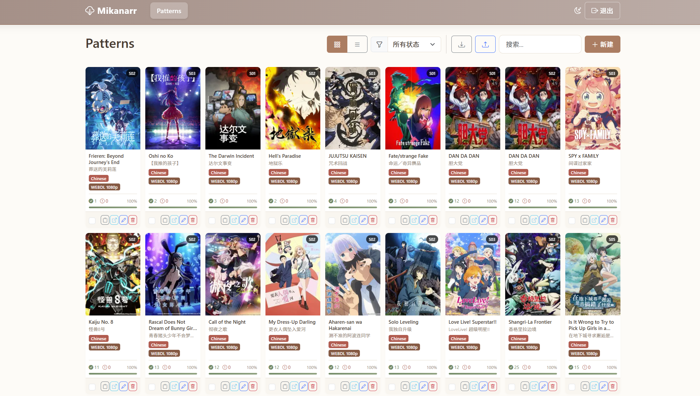
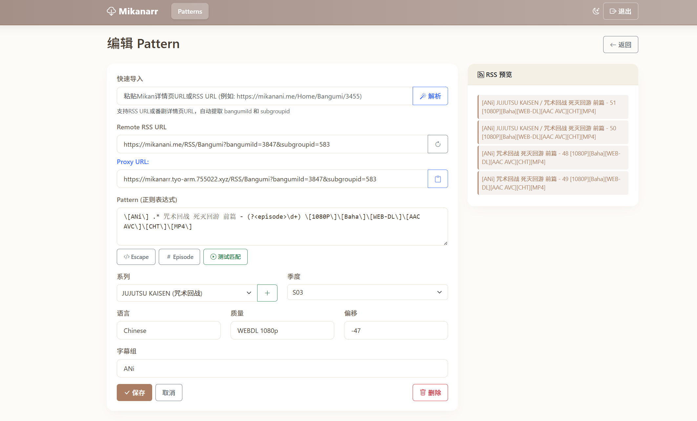

# Mikanarr Refactor

Mikanarr - Mikan Anime to Sonarr Bridge（重构版）

将 Mikan RSS 转换为 Sonarr 可识别的 RSS，并通过 Web 界面管理番剧匹配规则、Sonarr 剧集信息与 TMDB 元数据。




## 功能特性

- ✅ **RSS 转换**
  - 将 Mikan RSS 转换为 Sonarr 可识别的标准格式
  - 支持自定义正则表达式匹配剧集和集数
  - 支持 Season、Offset、语言、质量、发布组等规则配置
- ✅ **智能管理**
  - 自动同步 Sonarr 剧集列表
  - TMDB 中文剧集信息自动匹配，支持中文/英文搜索
  - 自动检测并修复大小写不一致的系列名
- ✅ **便捷操作**
  - **一键添加剧集**：从 RSS 搜索并添加新剧集到 Sonarr，可配置根目录和质量
  - **智能导入**：粘贴 Mikan RSS 或番剧页面 URL 自动解析参数并匹配剧集
  - **批量管理**：支持批量删除、批量修复系列名
  - **实时预览**：编辑正则表达式时实时预览匹配结果
- ✅ **现代化界面**
  - 美拉德（Maillard）配色风格及深色模式
  - **PWA 支持**：可安装到桌面或手机主屏幕
  - **响应式卡片视图**：适配桌面和移动端
  - 显示 TMDB / Sonarr 海报、Sonarr 下载进度和缺失集数
  - 移动端支持滑动操作
- ✅ **安全与部署**
  - 本地账号或 OIDC SSO 登录
  - 使用 HttpOnly Cookie Session，不再依赖浏览器保存登录 JWT
  - 登录限流、跨站请求保护及安全响应头
  - 对 Sonarr、Mikan、TMDB 和图片代理请求进行 URL/SSRF 限制
  - 支持 Traefik 等反向代理
  - Docker 默认只监听 `127.0.0.1`，并使用只读根文件系统、移除 Linux capabilities、`no-new-privileges` 等容器加固配置

## 快速开始

### Docker Compose 部署（推荐）

仓库已经提供完整的 `docker-compose.yml` 和 `.env.example`：

```bash
cp .env.example .env
# 编辑 .env：至少配置本地账号或完整 OIDC，并填写 Sonarr 参数
docker compose pull
docker compose up -d --wait
```

默认镜像：

```text
ghcr.io/sagehou/mikanarr-refactor:latest
```

生产环境建议通过 `IMAGE_NAME` 固定到已验证的 release tag 或 commit-SHA tag，避免 `latest` 后续变化导致非预期升级。

当前 Compose 部署有几个需要注意的默认行为：

- 数据保存在 Docker named volume `mikanarr-data`，挂载到容器 `/app/data`
- 默认端口绑定为 `127.0.0.1:12306:12306`，适合放在反向代理后面
- 如确实需要直接向可信 LAN 暴露，可在 `.env` 设置 `BIND_ADDRESS=0.0.0.0`，并自行配置防火墙
- 生产环境通过 HTTPS 访问时保持 `COOKIE_SECURE=true`
- 容器根文件系统为只读，仅 `/app/data` 与临时 `/tmp` 可写

> **从旧版本升级？** 旧版 README 使用 `./data:/app/data` bind mount，而当前版本改为 named volume。不要直接启动新版后再处理旧数据，请先阅读 [UPGRADE_NOTES.md](UPGRADE_NOTES.md) 中的迁移步骤并做好备份。

### 环境变量（`.env`）

| 变量名 | 说明 | 必填 / 默认 |
|---|---|---|
| `SONARR_API_KEY` | Sonarr API Key | Sonarr 集成必填 |
| `SONARR_HOST` | Mikanarr 后端访问 Sonarr 的地址 | Sonarr 集成必填，例如 `http://sonarr:8989` |
| `SONARR_PUBLIC_URL` | 浏览器跳转 Sonarr 时使用的外部地址 | 可选，未设置时回退到 `SONARR_HOST` |
| `TMDB_API_KEY` | TMDB API Key，用于中文信息和图片 | 可选 |
| `ADMIN_USERNAME` | 本地管理员用户名 | 与 `ADMIN_PASSWORD` 必须同时配置 |
| `ADMIN_PASSWORD` | 本地管理员密码 | 与 `ADMIN_USERNAME` 必须同时配置 |
| `BIND_ADDRESS` | Docker 发布端口监听地址 | 默认 `127.0.0.1` |
| `COOKIE_SECURE` | Session Cookie 是否仅通过 HTTPS 发送 | 生产默认 `true` |
| `TRUST_PROXY_HOPS` | 信任的固定反向代理跳数 | 默认 `0` |
| `IMAGE_NAME` | Compose 使用的镜像 | 默认 `ghcr.io/sagehou/mikanarr-refactor:latest` |
| `MIKANARR_HOST` | Traefik Host 规则 | 使用 Traefik override 时配置 |
| `TRAEFIK_NETWORK` | Traefik Docker 网络 | 默认 `traefik` |
| `TRAEFIK_ENTRYPOINT` | Traefik HTTPS entrypoint | 默认 `websecure` |

Mikanarr 必须至少配置一种登录方式：

1. 完整的 `ADMIN_USERNAME` + `ADMIN_PASSWORD`；或
2. 完整的 OIDC 配置。

未配置任何有效认证方式时，应用会拒绝启动，而不是以无认证状态运行。

### OIDC SSO 配置（可选）

当前版本使用 **OIDC Issuer Discovery**。如果启用 OIDC，以下四项必须全部配置：

| 变量名 | 说明 |
|---|---|
| `OIDC_ISSUER` | OIDC Issuer URL |
| `OIDC_CLIENT_ID` | Client ID |
| `OIDC_CLIENT_SECRET` | Client Secret |
| `OIDC_REDIRECT_URI` | Mikanarr OIDC Callback URL |
| `OIDC_ALLOWED_SUBJECTS` | 允许登录的 OIDC subject，多个值使用逗号分隔 |
| `OIDC_REQUIRED_GROUP` | 要求用户属于指定 group |
| `OIDC_GROUPS_CLAIM` | Group claim 名称，默认 `groups` |
| `OIDC_AUTO_LOGIN` | `true` 时自动进入 OIDC 登录流程，默认 `false` |

除了完整的 Issuer / Client / Secret / Redirect 配置以外，还必须至少设置：

- `OIDC_ALLOWED_SUBJECTS`；或
- `OIDC_REQUIRED_GROUP`

两者也可以同时使用。

Authentik 示例：

```env
OIDC_ISSUER=https://auth.example.com/application/o/mikanarr/
OIDC_CLIENT_ID=mikanarr
OIDC_CLIENT_SECRET=replace_with_your_oidc_client_secret
OIDC_REDIRECT_URI=https://mikanarr.example.com/auth/oidc/callback

# 至少配置一种授权规则
OIDC_REQUIRED_GROUP=mikanarr-users
# OIDC_ALLOWED_SUBJECTS=user-subject-1,user-subject-2

OIDC_GROUPS_CLAIM=groups
OIDC_AUTO_LOGIN=false
```

> 旧版本的 `OIDC_AUTH_URL` 和 `OIDC_TOKEN_URL` 已不再支持；如果仍保留这两个变量，当前版本会拒绝启动。请改用 `OIDC_ISSUER`。

生产环境下 OIDC Issuer 和 Redirect URI 必须使用 HTTPS。

### Traefik 部署

仓库提供 `docker-compose.traefik.yml` override，无需把 Traefik labels 手工复制到主 Compose：

```bash
docker compose -f docker-compose.yml -f docker-compose.traefik.yml up -d --wait
```

`.env` 示例：

```env
MIKANARR_HOST=mikanarr.example.com
TRAEFIK_NETWORK=traefik
TRAEFIK_ENTRYPOINT=websecure
COOKIE_SECURE=true
TRUST_PROXY_HOPS=1
```

其中：

- `${TRAEFIK_NETWORK:-traefik}` 必须是已经存在的 external Docker network
- Traefik 负责 TLS / 证书配置
- 如果 Traefik 是唯一且受保护的反向代理层，`TRUST_PROXY_HOPS=1`
- 不要为了“省事”设置比实际代理链更大的 `TRUST_PROXY_HOPS`，否则客户端可能伪造 `X-Forwarded-For`，影响登录限流

## 使用指南

### 1. 添加新订阅

1. 复制 Mikan 上的 RSS 链接或番剧详情页链接。
2. 在 Mikanarr 首页点击「新建」，或将链接粘贴到导入框后解析。
3. 系统会解析链接，并尝试在 Sonarr 中匹配对应剧集。
4. **如果 Sonarr 中已有剧集**：直接选择对应剧集。
5. **如果 Sonarr 中没有剧集**：
   - 点击系列输入框旁的 `+` 按钮
   - 搜索目标剧集
   - 选择正确结果并配置根目录、质量等参数
   - 添加成功后返回 Mikanarr 继续配置
6. 调整正则表达式（Pattern），通过实时预览确认能够提取正确的 `episode`。
7. 保存规则。

### 2. 在 Sonarr 中使用

Mikanarr 的 `/RSS` 路由会代理 Mikan RSS，并按已配置的规则转换标题。通常只需要把原 Mikan RSS 的域名替换为 Mikanarr 地址，并保留原来的路径和查询参数：

```text
原： https://mikanani.me/RSS/Bangumi?bangumiId=xxxx&subgroupid=yyy
新： https://mikanarr.example.com/RSS/Bangumi?bangumiId=xxxx&subgroupid=yyy
```

然后在 Sonarr 中将该 URL 配置为 RSS / Torznab 相关订阅入口（以你的 Sonarr 配置方式为准）。

## 升级与数据安全

升级前建议先备份应用数据，尤其是 `database.sqlite` 和认证密钥。当前版本的数据位于 Docker named volume `mikanarr-data` 中。

详细的：

- named volume 备份与恢复
- 从旧 `./data` bind mount 迁移
- 镜像回滚
- OIDC 配置迁移
- 凭据泄露后的密钥轮换

请参考：

- [UPGRADE_NOTES.md](UPGRADE_NOTES.md)
- [TROUBLESHOOTING.md](TROUBLESHOOTING.md)
- [QUICKSTART.md](QUICKSTART.md)

## 常见问题

### 图片加载失败？

Mikanarr 内置图片代理。Sonarr 或 TMDB 图片无法由浏览器直接访问时，可由后端代理加载。请确认 **Mikanarr 容器本身**能够访问相应的图片源。

### 添加剧集或加载 RSS 时提示超时？

优先检查：

- Mikanarr 到 Sonarr 的网络连通性
- Mikanarr 到 `mikanani.me` 的网络连通性
- `SONARR_HOST` 是否填写了容器可以访问的地址
- Sonarr API Key 是否有效

当前后端对外部 HTTP 请求设置了超时和响应大小限制；上游不可达或响应异常时会返回受控错误，而不会无限等待。

### 为什么推荐配置 TMDB API Key？

TMDB 并非 Mikanarr 工作的硬性依赖，但配置后可以获得中文剧名、搜索结果和海报等信息，使用体验会明显更完整。

### OIDC 配置后应用无法启动？

确认以下条件全部满足：

- `OIDC_ISSUER`、`OIDC_CLIENT_ID`、`OIDC_CLIENT_SECRET`、`OIDC_REDIRECT_URI` 四项齐全
- 至少配置了 `OIDC_ALLOWED_SUBJECTS` 或 `OIDC_REQUIRED_GROUP`
- 生产环境使用 HTTPS
- 已删除旧的 `OIDC_AUTH_URL` / `OIDC_TOKEN_URL`

## 本地开发

当前项目支持 Node.js 22 LTS 和 24 LTS：

```text
>=22.22.2 <23 || >=24.15.0 <25
```

推荐使用仓库声明的 npm 版本，然后安装依赖并执行完整检查：

```bash
npm ci
npm run check
```

开发模式：

```bash
npm run dev
```

## 许可证

ISC，详见 [LICENSE](LICENSE)。
